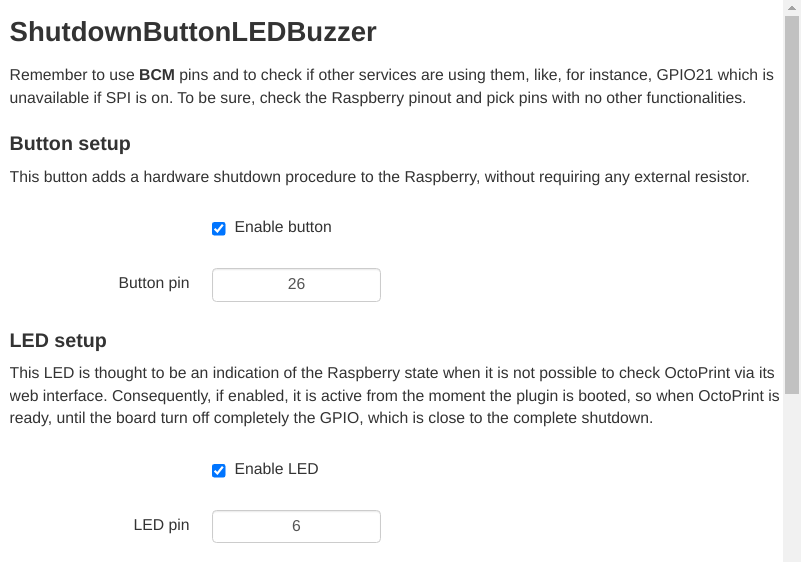
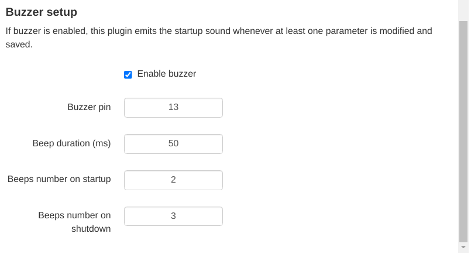
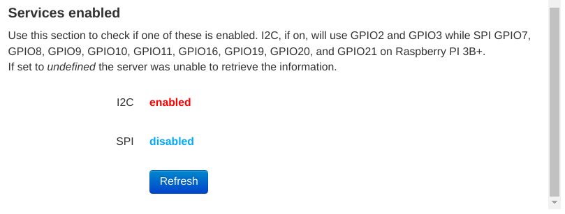

# ShutdownButtonLEDBuzzer

This OctoPrint plugin implements a shutdown physical button
for the Raspberry Pi. It offers also a status LED to know when
OctoPrint is ready and a buzzer to signal the startup and
the shutdown. Remember that these signals may vary of few
seconds.

By default, this plugin shuts down the Raspberry without
checking of there are ongoing jobs. In settings, there is
a flag to disable the button when printing.

## Notes

To shut down the Raspberry, it uses the command configured in
OctoPrint settings.

This plugin supports both active and passive buzzers. By default,
it assumes to have an active one.

## Setup

Install via the bundled 
[Plugin Manager](
https://docs.octoprint.org/en/master/bundledplugins/pluginmanager.html)
or manually using this URL:

    https://github.com/danieleborgo/OctoPrint-ShutdownButtonLEDBuzzer/archive/master.zip

## Circuit

The circuit hereafter exposed is just the one set by default,
since the plugin allows to edit each of these pin:

- Button: by default directly on pin GPIO26
- LED: by default on pin GPIO6
- Buzzer: by default on pin GPIO13

In case one of these features is not needed, it can be
deactivated by the apposite settings section.

Always remember to properly check each connection, using
the official datasheet, before turning on the Raspberry.

## Configuration

This plugin offers several configuration parameters,
accessible in the apposite OctoPrint section in setting:

## PCB

## FAQ

#### _What resistor does it need to use?_ 

There is no a precise resistor needed, since it depends on how much
light is needed. Despite this, it is suggested to use a value at
least of few thousands of ohms. Always remember to check the 
connections and the datasheet.

#### _Which buzzer does it need?_

The plugin supports both active that passive buzzer, but it is
necessary to configure them by the settings panel.

#### Which LED does it need?

A 5 mm LED is a good option, and it is usually in Arduino kits.
In case a different one is attached, check that the current it needs
is lower than the one a Raspberry pin can give.

## License

This software is distributed on GPLv3.0, more information
available in [LICENSE.md](
https://github.com/danieleborgo/OctoPrint-ShutdownButtonLEDBuzzer/blob/master/LICENSE.md).
